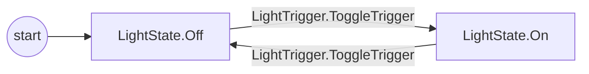

# LightSwitch

```mermaid
flowchart LR
  START((start)) --> S_LightState_Off
  S_LightState_Off[LightState.Off]
  S_LightState_On[LightState.On]
  S_LightState_Off -->|LightTrigger.ToggleTrigger| S_LightState_On
  S_LightState_On -->|LightTrigger.ToggleTrigger| S_LightState_Off
```
