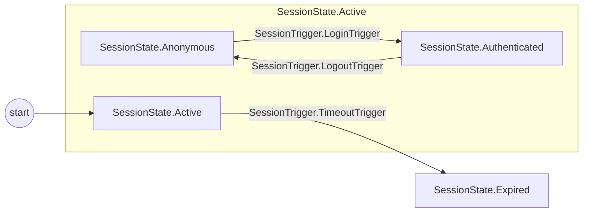

# SessionLogin

```mermaid
flowchart LR
  START((start)) --> S_SessionState_Active
  subgraph SG_SessionState_Active[SessionState.Active]
    S_SessionState_Active[SessionState.Active]
    S_SessionState_Anonymous[SessionState.Anonymous]
    S_SessionState_Authenticated[SessionState.Authenticated]
  end
  S_SessionState_Expired[SessionState.Expired]
  S_SessionState_Active -->|SessionTrigger.TimeoutTrigger| S_SessionState_Expired
  S_SessionState_Anonymous -->|SessionTrigger.LoginTrigger| S_SessionState_Authenticated
  S_SessionState_Authenticated -->|SessionTrigger.LogoutTrigger| S_SessionState_Anonymous
```
