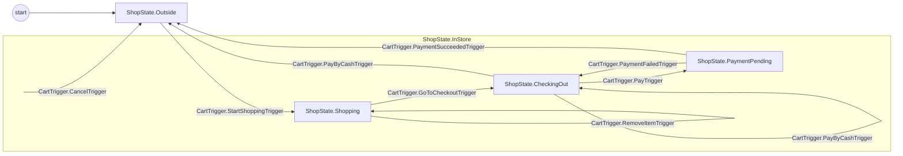

# ShoppingTrolley

```mermaid
flowchart LR
  START((start)) --> S_ShopState_Outside
  subgraph SG_ShopState_InStore[ShopState.InStore]
    P_ShopState_InStore(( ))
    S_ShopState_CheckingOut[ShopState.CheckingOut]
    S_ShopState_PaymentPending[ShopState.PaymentPending]
    S_ShopState_Shopping[ShopState.Shopping]
  end
  S_ShopState_Outside[ShopState.Outside]
  classDef superstatePort fill:transparent,stroke:transparent;
  class P_ShopState_InStore superstatePort;
  S_ShopState_CheckingOut -->|CartTrigger.PayByCashTrigger| S_ShopState_CheckingOut
  S_ShopState_CheckingOut -->|CartTrigger.PayByCashTrigger| S_ShopState_Outside
  S_ShopState_CheckingOut -->|CartTrigger.PayTrigger| S_ShopState_PaymentPending
  P_ShopState_InStore -->|CartTrigger.CancelTrigger| S_ShopState_Outside
  S_ShopState_Outside -->|CartTrigger.StartShoppingTrigger| S_ShopState_Shopping
  S_ShopState_PaymentPending -->|CartTrigger.PaymentFailedTrigger| S_ShopState_CheckingOut
  S_ShopState_PaymentPending -->|CartTrigger.PaymentSucceededTrigger| S_ShopState_Outside
  S_ShopState_Shopping -->|CartTrigger.GoToCheckoutTrigger| S_ShopState_CheckingOut
  S_ShopState_Shopping -->|CartTrigger.AddItemTrigger| S_ShopState_Shopping
  S_ShopState_Shopping -->|CartTrigger.RemoveItemTrigger| S_ShopState_Shopping
```
