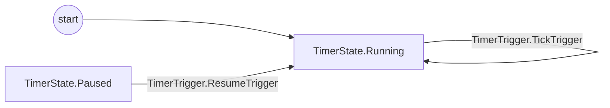

# Timer

```mermaid
flowchart LR
  START((start)) --> S_TimerState_Running
  S_TimerState_Paused[TimerState.Paused]
  S_TimerState_Running[TimerState.Running]
  S_TimerState_Paused -->|TimerTrigger.ResumeTrigger| S_TimerState_Running
  S_TimerState_Running -->|TimerTrigger.TickTrigger| S_TimerState_Running
```
