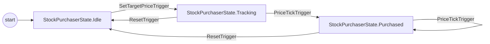

# StockPurchaser

```mermaid
flowchart LR
  START((start)) --> S_StockPurchaserState_Idle
  S_StockPurchaserState_Idle[StockPurchaserState.Idle]
  S_StockPurchaserState_Purchased[StockPurchaserState.Purchased]
  S_StockPurchaserState_Tracking[StockPurchaserState.Tracking]
  S_StockPurchaserState_Idle -->|SetTargetPriceTrigger| S_StockPurchaserState_Tracking
  S_StockPurchaserState_Purchased -->|ResetTrigger| S_StockPurchaserState_Idle
  S_StockPurchaserState_Purchased -->|PriceTickTrigger| S_StockPurchaserState_Purchased
  S_StockPurchaserState_Tracking -->|ResetTrigger| S_StockPurchaserState_Idle
  S_StockPurchaserState_Tracking -->|PriceTickTrigger| S_StockPurchaserState_Purchased
```
