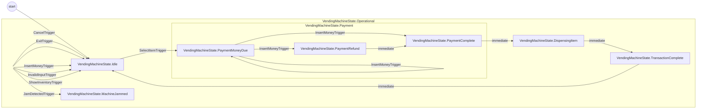

# VendingMachine

```mermaid
flowchart LR
  START((start)) --> S_VendingMachineState_Idle
  subgraph SG_VendingMachineState_Operational[VendingMachineState.Operational]
    P_VendingMachineState_Operational(( ))
    S_VendingMachineState_DispensingItem[VendingMachineState.DispensingItem]
    S_VendingMachineState_Idle[VendingMachineState.Idle]
    S_VendingMachineState_MachineJammed[VendingMachineState.MachineJammed]
    subgraph SG_VendingMachineState_Payment[VendingMachineState.Payment]
      S_VendingMachineState_PaymentComplete[VendingMachineState.PaymentComplete]
      S_VendingMachineState_PaymentMoneyDue[VendingMachineState.PaymentMoneyDue]
      S_VendingMachineState_PaymentRefund[VendingMachineState.PaymentRefund]
    end
    S_VendingMachineState_TransactionComplete[VendingMachineState.TransactionComplete]
  end
  classDef superstatePort fill:transparent,stroke:transparent;
  class P_VendingMachineState_Operational superstatePort;
  S_VendingMachineState_DispensingItem -->|immediate| S_VendingMachineState_TransactionComplete
  S_VendingMachineState_Idle -->|SelectItemTrigger| S_VendingMachineState_PaymentMoneyDue
  P_VendingMachineState_Operational -->|CancelTrigger| S_VendingMachineState_Idle
  P_VendingMachineState_Operational -->|ExitTrigger| S_VendingMachineState_Idle
  P_VendingMachineState_Operational -->|InsertMoneyTrigger| S_VendingMachineState_Idle
  P_VendingMachineState_Operational -->|InvalidInputTrigger| S_VendingMachineState_Idle
  P_VendingMachineState_Operational -->|ShowInventoryTrigger| S_VendingMachineState_Idle
  P_VendingMachineState_Operational -->|JamDetectedTrigger| S_VendingMachineState_MachineJammed
  S_VendingMachineState_PaymentComplete -->|immediate| S_VendingMachineState_DispensingItem
  S_VendingMachineState_PaymentMoneyDue -->|InsertMoneyTrigger| S_VendingMachineState_PaymentComplete
  S_VendingMachineState_PaymentMoneyDue -->|InsertMoneyTrigger| S_VendingMachineState_PaymentMoneyDue
  S_VendingMachineState_PaymentMoneyDue -->|InsertMoneyTrigger| S_VendingMachineState_PaymentRefund
  S_VendingMachineState_PaymentRefund -->|immediate| S_VendingMachineState_PaymentComplete
  S_VendingMachineState_TransactionComplete -->|immediate| S_VendingMachineState_Idle
```
